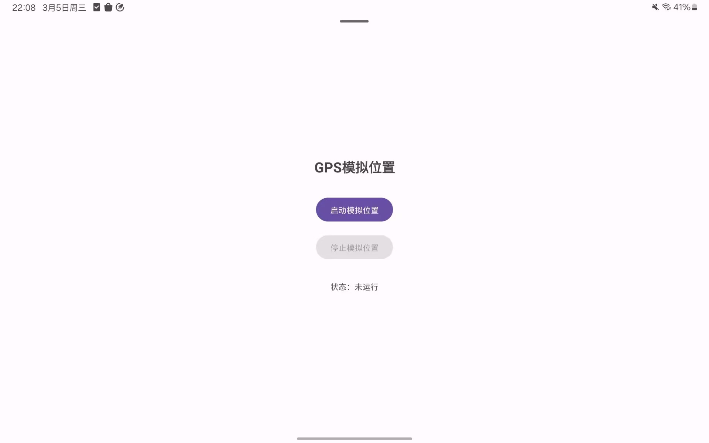
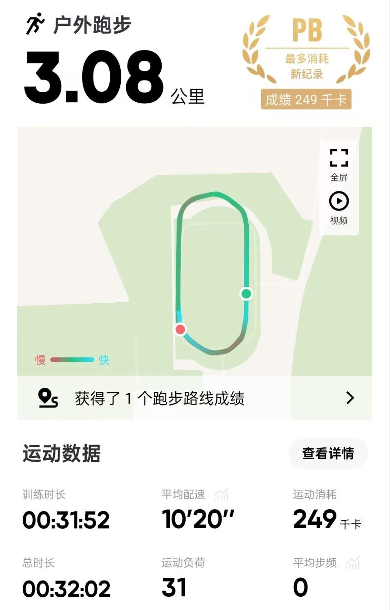

# 安卓 GPS 模拟工具

> [!WARNING]
> 本程序仅供学习交流使用，请勿用作不良用途
>
> 目前此软件仅经过不完全测试，请确保安装软件的设备上不存在**任何重要信息**
>
> 错误使用本工具可能导致**账号封禁等风险**，**使用者需自行承担一切后果**

## 项目描述

本软件提供简单的模拟 GPS 信号，旨在测试不同位置环境下，部分安卓软件的反应

模拟位置信息写在`/app/src/main/java/icu/kpmark/mocklocation/MockLocation.kt`中，以经纬度点集的形式存在，预设为某地的操场

启动软件后，将仿照人类按照位置移动的形式，向设备提供模拟 GPS 信号

## 所需环境

> [!NOTE]
> 本软件目前仅经过不完全测试，欢迎为本项目补全测试信息

- Android 14 及以上版本

需要手机中连击版本信息开启开发者模式，并在**选择模拟位置信息应用**一栏中选择本软件


部分手机可能不存在此选项，可尝试使用 adb 工具手动赋予软件此项权限

```bash
adb shell appops set icu.kpmark.mocklocation android:mock_location allow
```

> 部分软件，如 keep，可在旧版本中测试其对不同位置的反应

## 运行效果




